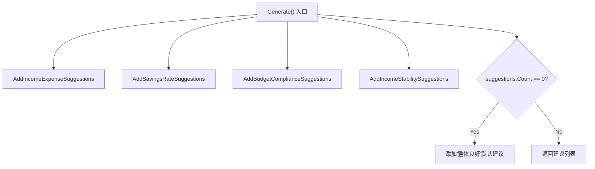
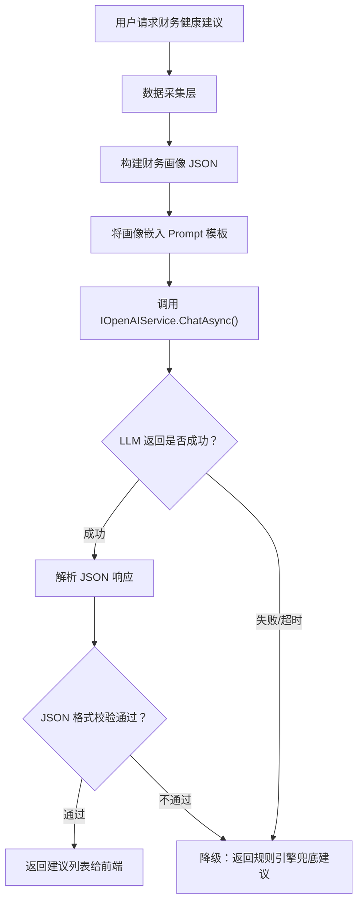

经过前面四篇文章的持续推进，孢子记账的智能化版图已经逐渐清晰起来。我们先后完成了硅基流动平台的接入配置、大模型接入方式的技术选型、LLM 调用层的统一封装，以及第一个智能化功能，智能生成预算的落地实现。至此，孢子记账已经具备了一套从"平台接入"到"能力封装"再到"业务落地"的完整智能化基础设施，大模型不再是停留在技术方案里的概念，而是真正跑在业务代码中、实实在在为用户产生价值的引擎。

然而智能化改造并不只有"从零到一创造新功能"这一种路径。在孢子记账的众多既有功能中，有些模块虽然已经上线运行，但它们的实现方式仍然停留在传统的"规则驱动"模式，通过硬编码的阈值判断和固定的文案模板来向用户反馈信息。这类功能"能用"，但远谈不上"好用"。它们缺乏对用户个体差异的感知，不会根据用户的实际财务行为动态调整输出，给出的建议往往千篇一律、缺乏说服力。而大模型的介入，恰恰能够为这类功能注入"理解力"，让系统不再只是机械地比对数字，而是能够像一位有经验的财务顾问一样，读懂数据背后的含义，给出有温度、有针对性、能真正打动用户的建议。

本篇文章，我们就将目光投向这样一个存量功能的智能化改造——**财务健康度建议**。

### 一、原功能回顾与痛点分析
在这一小节，我们回顾一下财务健康度建议现有功能，以及存在的痛点。

#### 1.1 原有功能回顾
原有功能的核心逻辑在 **`SuggestionEngine`** 类中，该类包含一个公共静态方法和四个私有静态方法。这个类根据用户的财务数据（收入、支出）和各维度的评分，自动生成结构化改善建议。原有功能的架构图如下：



原有功能的逻辑是这样的，系统会从四个维度进行分析，这四个维度分别是：收支比率、储蓄率、预算执行、收入稳定性。下面我们分别介绍每个维度的分析逻辑。

1. 收支比率
    收支比率计算很简单，我们使用支出 "总额/收入总额" 这个公式来计算收支比例，如果收支比率高于 1.0 就表示入不敷出，如果收支比如高于 0.9 但小于1.0 则表示财务紧张，如果收支比率高于 0.7 但小于 0.9 则代表支出偏高。计算完收支比率后，我们根据不同的比率值，给出固定的建议。

2. 储蓄率
    储蓄率的计算公式是 "(总收入-总支出)/总收入"，用于衡量用户的储蓄能力。如果储蓄率低于 0 则说明处于负债的情况，如果储蓄率 0.1 但高于 0 则说明当前入不敷出，如果储蓄率低于 0.2 但高于 0 则说明当前储蓄偏低。然后，根据储蓄率的不同区间，系统会给出相应的建议。

3. 预算执行
    将用户预算与同期实际支出按分类逐项比对，算出各分类超支率的平均分后，仅当该平均分 < 60（即多数预算类别超支 20% 以上）时才触发一条 Medium 优先级的建议，提醒用户"每周回顾实际支出、及时调整消费行为"。

4. 收入稳定性
    收入稳定性通过回溯 3 个月收入数据计算变异系数（CV = 标准差/均值）来量化波动程度，CV > 0.20（得分 < 60）时触发 Medium 级别建议"建立 3~6 个月应急储备金"，在总分中权重最低（15%~20%），属于辅助预警维度。

以上就是当前财务健康度建议功能的完整逻辑。表面上看，四个维度各司其职、阈值划分清晰，似乎已经构成了一套合理的评估体系。但当我们从"智能化"的视角重新审视这套规则时，几个深层次的问题便会浮现——这些问题并非逻辑错误，而是"规则驱动"模式本身的天花板。下面我们对这些痛点逐一进行分析。

#### 1.2 痛点分析
如果我们将上述四个维度的逻辑放在一起审视，会发现一个共同的特征，它们本质上都是"看到数字 → 比对阈值 → 吐出文案"的机械流程。系统做的所有事情，都可以用一连串 `if-else` 来概括。这种规则驱动模式在功能上线初期或许够用，毕竟有建议总比没有好，但当用户真正开始依赖这些建议来指导自己的财务决策时，它的局限性就会迅速暴露。

第一个痛点是**建议缺乏个性化**。在当前的实现中，一个月入 5000、刚毕业的实习生，和一个月入 30000、有房贷有孩子的中年职场人，只要他们的收支比率落在同一个区间里，收到的建议是完全一样的。系统不知道用户处于人生的哪个阶段，不了解他的消费结构是以房租为主还是以外卖为主，更无从判断他的财务压力究竟来自收入不足还是支出失控。这种"一刀切"的建议，就像去医院看病，医生不问你任何情况，只看了一眼体温计就开了同一种药，从流程上无可质疑，从效果上却很难对症。

第二个痛点是**建议缺乏上下文理解**。财务健康从来不是一个孤立的数字游戏，它与用户的生活方式、消费价值观和短期目标紧密相关。一个正在攒钱买房的人，对于"储蓄率偏低"的容忍度可能极低，而一个刚刚经历了裁员、正在过渡期的人，系统反复提醒他"储蓄不足"不仅毫无帮助，甚至可能加重焦虑。当前的规则引擎完全不具备理解这些背景信息的能力，它只能根据数字给出"正确但无关痛痒"的建议，就像一个只会背课本的学生，答案都对，却答非所问。

第三个痛点是**建议缺乏动态调整能力**。用户的财务状况是一个持续变化的动态过程，这个月因为换工作收入骤降，下个月可能因为拿到年终奖收入暴涨，双十一期间购物支出飙升，春节前后餐饮和礼品消费明显增加。然而当前的系统规则是静态的，阈值写死在代码里，文案写死在代码里，触发条件也写死在代码里。无论外部环境如何变化，系统的判断标准始终不变，这就导致它在某些时刻给出的建议彻底脱离实际，比如在用户刚刚加薪后仍然警告"收入稳定性不足"，或者在用户刻意控制消费的月份依然提示"支出偏高"。

第四个痛点也是最容易被技术团队忽视的一点，是**建议缺乏情感温度**。财务管理本质上是反人性的，它要求用户克制欲望、延迟满足、持续自律。在这个过程中，用户需要的往往不是冷冰冰的数据分析和居高临下的"你应该怎么做"，而是一种被理解的陪伴感。试想一个场景，用户这个月超支了，他自己心里已经有愧疚感，打开财务健康页面，系统如果只是机械地扔出一句"您的支出偏高，建议控制消费"，这种体验只会让用户想关掉 App。一个好的财务建议，应该像一个懂你的朋友，在看到你超支时会先说一句"这个月确实不容易"，然后再给出理性的分析和温和的建议——而这恰恰是规则引擎永远做不到的事情。

综合来看，这四个痛点并非彼此独立，而是"规则驱动"模式的四张面孔。它们的共同根源在于系统只是在"计算"，而不是在"理解"。要解决这些问题，我们需要引入一种能够理解上下文、感知个体差异、适应动态变化、输出有温度内容的引擎——而这正是大语言模型最擅长的事情，也是本篇文章接下来要做的智能化改造的核心目标。

### 二、智能化改造设计思路
明确了痛点之后，改造的方向其实已经呼之欲出，我们需要用大模型替换掉原有的规则引擎，让系统从"计算数字"升级为"理解财务"。但方向的明确只是第一步，真正进入设计阶段时，我们会发现这并非简单地把原来的 `if-else` 换成一次 LLM 调用就能完成的事。我们需要回答几个关键问题：给模型输入什么数据？如何设计 Prompt 才能让模型产出稳定、可用、有温度的建议？模型返回的结果如何与前端展示对接？以及万一模型返回了不合理的建议，我们如何兜底？

#### 2.1 整体思路：从"规则判断"到"数据 + 推理"
回顾上一节分析的四个痛点，缺乏个性化、缺乏上下文理解、缺乏动态调整能力、缺乏情感温度，它们的共同根源是系统在做判断时看到的只是孤立的数字快照。因此，改造的核心思路就是**不再只给模型一个数字让它判断高低，而是给它一幅完整的财务画像，让它去理解这个数字背后的故事**。

具体来说就是原有规则引擎的输入是四个维度的计算结果（收支比率、储蓄率、预算执行分、收入稳定性），输出是根据阈值匹配的固定文案。改造后，我们将不再让代码去计算这些比率然后做判断，这些工作全部交给模型。代码的职责从"判断者"转变为"采集者"和"搬运工"，它负责从数据库拉取多维度的原始财务数据，整理成结构化的文本描述，然后交给模型去理解、分析和生成建议。

这样做的好处是显而易见的。模型看到的不再是"储蓄率 = 0.15"这样一个孤零零的数字，而是"该用户过去三个月的月均收入为 12000 元，月均支出为 10200 元，储蓄率约 15%。其中餐饮支出占比 35%，高于同收入群体均值 25%。近三个月收入波动较小（CV = 0.08），但双十一当月购物支出较常态增长 200%"。当信息量从一句话扩展为一段完整的财务素描时，模型就能够像一位真正的财务顾问一样，结合多个信号交叉印证，给出既有数据支撑又有人情味的建议。

#### 2.2 数据采集：构建"财务画像"
那么，这幅"财务画像"具体应该包含哪些信息？结合四个分析维度，我们设计的数据采集清单如下：

**基础收支数据**：当前月份的总收入、总支出，以及过去三个月的月均收入和月均支出。这部分数据让模型了解用户整体的收支规模和近期趋势，是画像的骨架。
**分类支出明细**：按支出分类（餐饮、交通、购物、娱乐、房租、医疗等）统计当月各分类的支出金额和占比。这部分数据是画像的血肉，模型可以从中发现消费结构的特征，比如餐饮占比异常偏高可能意味着外卖依赖，购物支出集中爆发可能与大促活动相关。
**预算执行数据**：用户当月在各分类上的预算额度与实际支出的对比，以及超支或节余的百分比。预算执行情况反映了用户对自身消费的规划能力和执行纪律，也是衡量财务健康度的重要维度。
**储蓄与结余数据**：当月的储蓄金额、储蓄率，以及过去三个月储蓄率的趋势变化（上升、下降或平稳）。储蓄数据是财务健康的核心指标，配合趋势信息，模型可以发现储蓄率持续下滑的预警信号。
**收入稳定性数据**：过去三个月的月收入列表，以及收入波动系数。收入稳定性的分析不能只看一个数字，模型需要结合收入来源的性质来判断，比如自由职业者收入波动大是常态，而固定薪资人员出现大幅波动则可能意味着职业变动。
**可选历史建议记录**：用户最近一次收到的财务健康建议内容。引入历史建议可以让模型在生成新建议时避免简单重复，同时能够感知到"这个问题我们上次已经提醒过，这次语气应该更关切一些"，从而增强建议的连续性和递进感。

#### 2.3 Prompt 设计：让模型成为财务顾问
数据准备就绪之后，最关键的一环就是 Prompt 的设计。Prompt 的质量直接决定了模型输出的质量，同样的数据，Prompt 写得好，模型输出的是专业、温暖、可落地的建议，Prompt 写得不好，模型可能输出一堆正确的废话，甚至给出不切实际的指导。在设计财务健康建议的 Prompt 时，我们遵循了以下几个原则：

**第一，明确角色定位。** Prompt 的开头需要为模型设定一个清晰的人设，这决定了它输出的语气和视角。我们给模型的角色设定是，"你是一位经验丰富的个人财务管理顾问，擅长用通俗易懂的语言帮助普通用户理解自己的财务状况。你的风格是温和但专业，善于在指出问题的同时给予鼓励，而不是居高临下地批评。"这个角色设定直接回应了第四个痛点，缺乏情感温度。
**第二，结构化输入数据。** 将上一节采集的财务画像数据以清晰的标签格式嵌入 Prompt，每一类数据前面加上明确的标识，比如 `【收入支出概况】`、`【分类支出明细】`、`【预算执行情况】`。这样做可以让模型准确区分不同类型的信息，避免理解错位。
**第三，约束输出格式。** 我们不希望模型天马行空地输出一大段自由文本，前端需要结构化的数据来渲染界面。因此我们在 Prompt 中明确要求模型返回 JSON 格式，字段包括建议标题、建议内容、优先级、关联维度等。同时我们提供一个 JSON Schema 示例，让模型严格遵循结构输出。
**第四，注入"温度"指令。** 我们在 Prompt 中明确告诉模型，"你的建议应该在指出问题的同时表达理解和共情。例如，如果用户超支严重，不要只说'您的支出偏高，建议控制消费'，而应该说'这个月您的购物支出比平时多了不少，双十一确实容易让人冲动消费，这完全可以理解。不过如果下个月能适当收紧这部分预算，整体的财务状况会更加健康'。"。通过给出具体的范例，我们引导模型产出有温度的、口语化的、真正能打动用户的建议。
**第五，设置安全边界。** 我们还在 Prompt 中强调，不要给出任何具体的投资建议（如"建议买入某只基金"），不要对用户的消费选择做道德评判（如"你不应该花这么多钱在游戏上"），只在财务规划和消费习惯的范围内给出合理建议。这是一个重要的合规性设计。

#### 2.4 新架构流程
设计思路梳理清楚之后，我们来看改造后的整体流程。与原有 `SuggestionEngine` 中一条直线走到底的流程不同，改造后的流程引入了 LLM 调用环节，整体架构如下：



对比原有流程，新架构有几个关键变化。首先数据采集的范围大幅扩展，从原来的四个计算结果扩展为多维度的原始财务数据。其次核心推理环节从本地代码转移到了远端大模型。最后我们引入了一个重要的**降级兜底机制**，当 LLM 调用失败、超时或返回格式不合规时，系统会回退到原有的规则引擎，确保用户在任何情况下都能收到一份可用的建议，而不是看到一个报错页面。

这个降级策略的设计体现了智能化改造中的一个重要原则，**AI 是增强而非替代**。在追求智能化体验的同时，系统的可用性和稳定性始终是第一位的。即使大模型暂时不可用，用户的核心体验也应当得到基本保障。

### 三、核心代码实现
根据上一小节中改造设计思路，我们进行了完整实现，那么在这一小节我们将针对核心代码进行讲解。

#### 3.1 FinancialPortraitData 财务画像的数据载体
我们先来看看财务画像的数据载体是如何实现的，这里这展示数据载体的核心代码：

```csharp
namespace SP.FinanceService.Score;

/// <summary>
/// LLM 驱动的财务画像数据，承载多维度的原始财务信息
/// </summary>
public class FinancialPortraitData
{
    /// <summary>
    /// 账本 ID
    /// </summary>
    public long AccountBookId { get; set; }

    /// <summary>
    /// 账本名称
    /// </summary>
    public string AccountBookName { get; set; } = string.Empty;

    /// <summary>
    /// 用户拥有的账本总数（用于 LLM 理解数据范围；>1 时本画像仅为部分财务数据）
    /// </summary>
    public int AccountBookCount { get; set; } = 1;

    /// <summary>
    /// 是否为全量聚合视图（true=用户所有账本汇总，false=单个账本）
    /// </summary>
    public bool IsAggregate { get; set; }

    /// <summary>
    /// 统计周期开始日期
    /// </summary>
    public DateTime PeriodStart { get; set; }

    /// <summary>
    /// 统计周期结束日期
    /// </summary>
    public DateTime PeriodEnd { get; set; }

    /// <summary>
    /// 当月总收入
    /// </summary>
    public decimal MonthlyIncome { get; set; }

    /// <summary>
    /// 当月总支出
    /// </summary>
    public decimal MonthlyExpense { get; set; }

    /// <summary>
    /// 近三个月月均收入
    /// </summary>
    public decimal AvgMonthlyIncome3M { get; set; }

    /// <summary>
    /// 近三个月月均支出
    /// </summary>
    public decimal AvgMonthlyExpense3M { get; set; }

    /// <summary>
    /// 当月储蓄金额
    /// </summary>
    public decimal MonthlySavings => MonthlyIncome - MonthlyExpense;

    /// <summary>
    /// 当月储蓄率
    /// </summary>
    public decimal SavingsRate => MonthlyIncome > 0 ? MonthlySavings / MonthlyIncome : 0;

    /// <summary>
    /// 近三个月储蓄率趋势：每个月的 (年, 月, 储蓄率)
    /// </summary>
    public List<MonthlySavingsTrend> SavingsTrend3M { get; set; } = new();

    /// <summary>
    /// 当月各支出分类明细
    /// </summary>
    public List<CategoryExpenseDetail> CategoryDetails { get; set; } = new();

    /// <summary>
    /// 当月预算执行情况
    /// </summary>
    public List<BudgetExecutionDetail> BudgetExecution { get; set; } = new();

    /// <summary>
    /// 近三个月各月收入列表
    /// </summary>
    public List<MonthlyIncomeItem> MonthlyIncomes3M { get; set; } = new();

    /// <summary>
    /// 收入波动系数 (CV = 标准差 / 均值)
    /// </summary>
    public decimal? IncomeCV { get; set; }

    /// <summary>
    /// 最近一次历史建议内容（可选）
    /// </summary>
    public string? LastSuggestionContent { get; set; }

    /// <summary>
    /// 最近一次健康评分（可选）
    /// </summary>
    public decimal? LastTotalScore { get; set; }
}
```

`FinancialPortraitData` 是整个智能化改造的数据基石，它定义了一幅完整财务画像所应包含的全部信息维度。这个类在设计上刻意追求"数据丰富但结构扁平"，每一个字段都对应 LLM 理解用户财务状况所需的一个具体事实。`AccountBookId` 和 `AccountBookName` 标识了当前分析的目标账本，`AccountBookCount` 和 `IsAggregate` 为 LLM 提供了关键的数据范围上下文，当用户拥有多个账本时，模型需要知道眼前的数据是全部汇总还是仅其中一部分，这直接影响模型给出的建议是"针对该账本"还是"针对整体财务"。画像的核心部分是 `MonthlyIncome` 和 `MonthlyExpense` 这两个当月汇总值，配合 `AvgMonthlyIncome3M` 和 `AvgMonthlyExpense3M` 这两个近三个月均值，让 LLM 能够在"当月快照"和"近期趋势"之间形成对照。`MonthlySavings` 和 `SavingsRate` 是两个计算属性，它们并非从数据库直接读取，而是由收入和支出动态推导，这样设计的好处是数据一致性由类自身保证，外部构建者只需填入收支数据即可。`SavingsTrend3M` 列表记录了近三个月每个月的储蓄率，它不是单一数值而是一个时间序列，这让 LLM 能够感知储蓄率是在上升、下降还是保持平稳，从而在建议中体现趋势判断。`CategoryDetails` 是当月各支出分类的金额和占比明细，这是画像中信息密度最高的部分，模型从中发现消费结构的特征，比如餐饮占比异常偏高可能是外卖依赖，购物支出集中爆发可能与大促活动相关。`BudgetExecution` 记录了每个预算分类的计划额度与实际支出的对比，并通过 `OverrunRate` 表达了超支或节余的百分比，正值表示超支、负值表示节余，这个符号约定让 Prompt 中的描述逻辑非常简洁。`MonthlyIncomes3M` 和 `IncomeCV` 共同描绘了收入的数量和稳定性两个维度，系数 CV 是对收入波动程度的数学量化，配合具体的月度收入列表，模型既可以做客观的统计判断，也可以结合收入来源性质做主观解读。`LastTotalScore` 和 `LastSuggestionContent` 是可选的历史参考字段，它们让 LLM 能够感知"上次已经给过什么建议、当时的评分是多少"，从而在新建议中体现连续性和递进感，避免每次都说同样的内容。

#### 3.2 FinancialPortraitBuilder 从数据库到画像的采集引擎
接下来，我们再看看 FinancialPortraitBuilder，它负责将数据库中的原始财务数据采集并构建成 `FinancialPortraitData` 对象。这个类的核心职责是数据转换和聚合，它将分散在各个表中的收入、支出、预算等信息整合成一个统一的画像，为后续的智能化分析提供基础。

```csharp
using Microsoft.EntityFrameworkCore;
using SP.FinanceService.DB;
using SP.FinanceService.Models.Enumeration;

namespace SP.FinanceService.Score;

/// <summary>
/// 财务画像数据构建器
/// 从数据库采集多维原始财务数据，构建 LLM 可理解的财务画像
/// <para>支持两种模式：单个账本分析 / 用户全部账本汇总分析</para>
/// </summary>
public static class FinancialPortraitBuilder
{
    /// <summary>
    /// 构建单个账本的财务画像
    /// </summary>
    /// <param name="dbContext">数据库上下文</param>
    /// <param name="accountBookId">账本 ID</param>
    /// <param name="userId">用户 ID（用于过滤预算等用户级数据）</param>
    /// <param name="periodStart">统计周期开始日期</param>
    /// <param name="periodEnd">统计周期结束日期</param>
    /// <returns>财务画像数据</returns>
    public static Task<FinancialPortraitData> BuildAsync(
        FinanceServiceDbContext dbContext,
        long accountBookId,
        long userId,
        DateTime periodStart,
        DateTime periodEnd)
    {
        return BuildCoreAsync(dbContext, new List<long> { accountBookId }, userId, periodStart, periodEnd,
            isAggregate: false);
    }

    /// <summary>
    /// 构建用户全部账本汇总的财务画像
    /// </summary>
    /// <param name="dbContext">数据库上下文</param>
    /// <param name="userId">用户 ID</param>
    /// <param name="periodStart">统计周期开始日期</param>
    /// <param name="periodEnd">统计周期结束日期</param>
    /// <returns>财务画像数据，用户无账本时返回仅含基础信息的 portrait</returns>
    public static async Task<FinancialPortraitData> BuildForAllAccountBooksAsync(
        FinanceServiceDbContext dbContext,
        long userId,
        DateTime periodStart,
        DateTime periodEnd)
    {
        var accountBookIds = await dbContext.AccountBooks
            .Where(ab => ab.CreateUserId == userId && !ab.IsDeleted)
            .Select(ab => ab.Id)
            .ToListAsync();

        if (accountBookIds.Count == 0)
        {
            return new FinancialPortraitData
            {
                AccountBookName = "暂无账本",
                AccountBookCount = 0,
                IsAggregate = true,
                PeriodStart = periodStart,
                PeriodEnd = periodEnd
            };
        }

        return await BuildCoreAsync(dbContext, accountBookIds, userId, periodStart, periodEnd,
            isAggregate: accountBookIds.Count > 1);
    }

    // ══════ 核心实现 ═══════════════════════════════════════════════════════════

    /// <summary>
    /// 核心构建方法：加载数据并构建财务画像对象（不涉及数据库持久化）
     /// 支持单账本和全账本两种模式，通过 isAggregate 参数区分
     /// 该方法内部会根据账本数量和 isAggregate 参数智能设置画像中的数据范围说明字段，帮助 LLM 理解画像的适用范围
    /// </summary>
    /// <param name="dbContext"></param>
    /// <param name="accountBookIds"></param>
    /// <param name="userId"></param>
    /// <param name="periodStart"></param>
    /// <param name="periodEnd"></param>
    /// <param name="isAggregate"></param>
    /// <returns></returns>
    private static async Task<FinancialPortraitData> BuildCoreAsync(
        FinanceServiceDbContext dbContext,
        List<long> accountBookIds,
        long userId,
        DateTime periodStart,
        DateTime periodEnd,
        bool isAggregate)
    {
        // ── 0. 获取账本基础信息与用户账本总数 ──
        int accountBookCount = await dbContext.AccountBooks
            .CountAsync(ab => ab.CreateUserId == userId && !ab.IsDeleted);

        string accountBookName;
        if (isAggregate)
        {
            var names = await dbContext.AccountBooks
                .Where(ab => accountBookIds.Contains(ab.Id))
                .Select(ab => ab.Name)
                .ToListAsync();
            accountBookName = names.Count > 0
                ? $"全部账本（{string.Join("、", names)}）"
                : "全部账本";
        }
        else
        {
            var book = await dbContext.AccountBooks
                .Where(ab => ab.Id == accountBookIds[0] && !ab.IsDeleted)
                .Select(ab => ab.Name)
                .FirstOrDefaultAsync();
            accountBookName = book ?? "未知账本";
        }

        var portrait = new FinancialPortraitData
        {
            AccountBookId = isAggregate ? 0 : accountBookIds[0],
            AccountBookName = accountBookName,
            AccountBookCount = accountBookCount,
            IsAggregate = isAggregate,
            PeriodStart = periodStart,
            PeriodEnd = periodEnd
        };

        // ── 1. 加载当月记账条目 ──
        var periodEntries = await LoadEntriesAsync(dbContext, accountBookIds, periodStart, periodEnd);

        // ── 2. 基础收支数据 ──
        portrait.MonthlyIncome = periodEntries
            .Where(e => e.Type == TransactionCategoryEnmu.Income)
            .Sum(e => e.Amount);
        portrait.MonthlyExpense = periodEntries
            .Where(e => e.Type == TransactionCategoryEnmu.Expenditure)
            .Sum(e => e.Amount);

        // ── 3. 近三个月月均收支 ──
        var threeMonthStart = periodStart.AddMonths(-2);
        var threeMonthEntries = await LoadEntriesAsync(dbContext, accountBookIds, threeMonthStart, periodEnd);
        var monthlyIncomeGroups = threeMonthEntries
            .Where(e => e.Type == TransactionCategoryEnmu.Income)
            .GroupBy(e => new { e.Year, e.Month })
            .Select(g => g.Sum(e => e.Amount))
            .ToList();
        var monthlyExpenseGroups = threeMonthEntries
            .Where(e => e.Type == TransactionCategoryEnmu.Expenditure)
            .GroupBy(e => new { e.Year, e.Month })
            .Select(g => g.Sum(e => e.Amount))
            .ToList();

        portrait.AvgMonthlyIncome3M = monthlyIncomeGroups.Count > 0
            ? Math.Round(monthlyIncomeGroups.Average(), 2)
            : 0;
        portrait.AvgMonthlyExpense3M = monthlyExpenseGroups.Count > 0
            ? Math.Round(monthlyExpenseGroups.Average(), 2)
            : 0;

        // ── 4. 储蓄率趋势（近三个月） ──
        portrait.SavingsTrend3M = threeMonthEntries
            .GroupBy(e => new { e.Year, e.Month })
            .Select(g =>
            {
                decimal inc = g.Where(e => e.Type == TransactionCategoryEnmu.Income).Sum(e => e.Amount);
                decimal exp = g.Where(e => e.Type == TransactionCategoryEnmu.Expenditure).Sum(e => e.Amount);
                return new MonthlySavingsTrend
                {
                    Year = g.Key.Year,
                    Month = g.Key.Month,
                    SavingsRate = inc > 0 ? Math.Round((inc - exp) / inc, 4) : 0
                };
            })
            .OrderBy(t => t.Year).ThenBy(t => t.Month)
            .ToList();

        // ── 5. 分类支出明细 ──
        var categoryExpenses = periodEntries
            .Where(e => e.Type == TransactionCategoryEnmu.Expenditure)
            .GroupBy(e => e.CategoryId)
            .ToList();

        if (categoryExpenses.Count > 0 && portrait.MonthlyExpense > 0)
        {
            var categoryIds = categoryExpenses.Select(g => g.Key).ToList();
            var categories = await dbContext.TransactionCategories
                .Where(c => categoryIds.Contains(c.Id))
                .ToDictionaryAsync(c => c.Id, c => c.Name);

            portrait.CategoryDetails = categoryExpenses
                .OrderByDescending(g => g.Sum(e => e.Amount))
                .Select(g =>
                {
                    decimal amount = g.Sum(e => e.Amount);
                    return new CategoryExpenseDetail
                    {
                        CategoryName = categories.TryGetValue(g.Key, out var name) ? name : "未知分类",
                        Amount = amount,
                        Percentage = Math.Round(amount / portrait.MonthlyExpense, 4)
                    };
                })
                .ToList();
        }

        // ── 6. 预算执行情况（预算为用户级数据，按 CreateUserId 过滤） ──
        var budgets = await dbContext.Budgets
            .Where(b => b.CreateUserId == userId
                        && b.StartTime <= periodEnd
                        && b.EndTime >= periodStart
                        && !b.IsDeleted)
            .ToListAsync();

        if (budgets.Count > 0)
        {
            var budgetCategoryIds = budgets.Select(b => b.TransactionCategoryId).Distinct().ToList();
            var budgetCategories = await dbContext.TransactionCategories
                .Where(c => budgetCategoryIds.Contains(c.Id))
                .ToDictionaryAsync(c => c.Id, c => c.Name);

            portrait.BudgetExecution = budgets.Select(b =>
            {
                decimal actual = periodEntries
                    .Where(e => e.CategoryId == b.TransactionCategoryId
                                && e.Type == TransactionCategoryEnmu.Expenditure)
                    .Sum(e => e.Amount);
                decimal overrunRate = b.Amount > 0
                    ? Math.Round((actual - b.Amount) / b.Amount, 4)
                    : 0;
                return new BudgetExecutionDetail
                {
                    CategoryName = budgetCategories.TryGetValue(b.TransactionCategoryId, out var name) ? name : "未知分类",
                    BudgetAmount = b.Amount,
                    ActualAmount = actual,
                    OverrunRate = overrunRate
                };
            }).ToList();
        }

        // ── 7. 收入稳定性数据 ──
        portrait.MonthlyIncomes3M = threeMonthEntries
            .Where(e => e.Type == TransactionCategoryEnmu.Income)
            .GroupBy(e => new { e.Year, e.Month })
            .Select(g => new MonthlyIncomeItem
            {
                Year = g.Key.Year,
                Month = g.Key.Month,
                Income = g.Sum(e => e.Amount)
            })
            .OrderBy(m => m.Year).ThenBy(m => m.Month)
            .ToList();

        var incomes = portrait.MonthlyIncomes3M.Select(m => m.Income).ToList();
        if (incomes.Count >= 2)
        {
            decimal mean = incomes.Average();
            if (mean > 0)
            {
                decimal variance = incomes.Sum(x => (x - mean) * (x - mean)) / incomes.Count;
                decimal stdDev = (decimal)Math.Sqrt((double)variance);
                portrait.IncomeCV = Math.Round(stdDev / mean, 4);
            }
        }

        // ── 8. 最近一次历史建议 ──
        var lastScore = await dbContext.FinancialHealthScores
            .Where(s => accountBookIds.Contains(s.AccountBookId)
                        && !s.IsDeleted)
            .OrderByDescending(s => s.PeriodEnd)
            .FirstOrDefaultAsync();

        if (lastScore != null)
        {
            portrait.LastTotalScore = lastScore.TotalScore;
            portrait.LastSuggestionContent = lastScore.HealthLevel.ToString();
        }

        return portrait;
    }

    /// <summary>
    /// 从数据库加载指定账本列表、时间段内的记账条目（内部记录）
    /// </summary>
    /// <param name="dbContext"></param>
    /// <param name="accountBookIds"></param>
    /// <param name="start"></param>
    /// <param name="end"></param>
    /// <returns></returns>
    private static async Task<List<EntryRecord>> LoadEntriesAsync(
        FinanceServiceDbContext dbContext,
        List<long> accountBookIds,
        DateTime start,
        DateTime end)
    {
        var raw = await (
            from a in dbContext.Accountings
            join tc in dbContext.TransactionCategories on a.TransactionCategoryId equals tc.Id
            where accountBookIds.Contains(a.AccountBookId)
                  && a.RecordDate >= start
                  && a.RecordDate <= end
                  && !a.IsDeleted
                  && !tc.IsDeleted
            select new
            {
                a.AfterAmount,
                tc.Type,
                a.TransactionCategoryId,
                a.RecordDate.Year,
                a.RecordDate.Month
            }
        ).ToListAsync();

        return raw.Select(r =>
            new EntryRecord(r.AfterAmount, r.Type, r.TransactionCategoryId, r.Year, r.Month)
        ).ToList();
    }

    /// <summary>
    /// 记账条目内部记录
    /// </summary>
    /// <param name="Amount"></param>
    /// <param name="Type"></param>
    /// <param name="CategoryId"></param>
    /// <param name="Year"></param>
    /// <param name="Month"></param>
    private record EntryRecord(
        decimal Amount,
        TransactionCategoryEnmu Type,
        long CategoryId,
        int Year,
        int Month);
}
```

`FinancialPortraitBuilder` 的角色是将 `FinancialPortraitData` 这个数据模型从"空壳"填充为"有血有肉的画像"。它是一个纯静态工具类，不持有任何状态，所有数据都通过参数传入的 `FinanceServiceDbContext` 实时查询获得。这个类最核心的设计决策是将单账本分析和全账本汇总分析统一到了同一个内部实现 `BuildCoreAsync` 中，对外暴露两个语义清晰的入口方法，`BuildAsync` 接受单个 `accountBookId`，内部只是将其包装为单元素列表后委托给 `BuildCoreAsync`，`BuildForAllAccountBooksAsync` 则先查询用户拥有的全部账本 ID 列表，再以 `isAggregate: true` 的模式调用核心逻辑。这两个入口在账本名称的生成策略上也做了区分，单账本模式直接使用该账本的名称，全账本模式则拼接为"全部账本（账本A、账本B）"的形式，让 LLM 一眼就能看出数据的聚合范围。

`BuildCoreAsync` 的执行流程分为八个步骤，每一步都对应画像的一个维度。步骤 0 负责查询账本基础信息和用户账本总数，这是后续所有查询的"元数据"。步骤 1 通过 `LoadEntriesAsync` 加载记账条目，这个方法内部使用 LINQ 的 `Contains` 操作符实现了对多个账本 `ID` 的统一查询，避免了单账本和全账本两套 SQL 逻辑的重复。步骤 2 到步骤 7 依次计算基础收支、近三月月均、储蓄率趋势、分类支出明细、预算执行情况、收入稳定性，这些计算全部在内存中完成，数据已经通过步骤1一次性加载到 `List<EntryRecord>` 中，后续的 `GroupBy`、`Sum`、`Average` 等聚合操作都不会产生额外的数据库查询。这种"一次加载、内存计算"的策略在数据量可控的场景下既保证了代码简洁性，又避免了 N+1 查询问题。步骤 6 的预算查询独立于记账条目，因为 `Budget` 实体没有 `AccountBookId` 字段，预算属于用户级数据，因此这里使用 `CreateUserId` 而非账本 `ID` 列表进行过滤。步骤 8 查询最近一次健康评分记录作为历史参考，在全账本模式下使用 `Contains` 匹配所有账本 `ID` 中最新的那条记录。整个构建流程的设计遵循了一个原则，数据库查询尽可能少且并行化程度高，内存计算尽可能利用 LINQ 的表达能力将原始数据转化为结构化信息。

#### 3.3 SuggestionPromptBuilder 将数据翻译为 LLM 可理解的对话
下面我们再来看看 `SuggestionPromptBuilder` 的实现逻辑，它的主要作用是将数据翻译为大模型可理解的对话，代码如下：

```csharp
using System.Text;

namespace SP.FinanceService.Score;

/// <summary>
/// 财务建议 Prompt 构建器 —— 将财务画像数据嵌入精心设计的 Prompt 模板
/// </summary>
public static class SuggestionPromptBuilder
{
    /// <summary>
    /// 根据财务画像数据构建完整的 Prompt
    /// </summary>
    /// <param name="portrait">财务画像数据</param>
    /// <returns>完整的 Prompt 字符串</returns>
    public static string Build(FinancialPortraitData portrait)
    {
        var sb = new StringBuilder();

        // ══════ 角色定位 ══════
        sb.AppendLine("你是一位经验丰富的个人财务管理顾问，擅长用通俗易懂的语言帮助普通用户理解自己的财务状况。");
        sb.AppendLine("你的风格是温和但专业，善于在指出问题的同时给予鼓励，而不是居高临下地批评。");
        sb.AppendLine("你给出的每一条建议都应该是具体的、可落地的，而不是空洞的口号。");
        sb.AppendLine();

        // ══════ 数据输入 ══════
        sb.AppendLine("下面是一位用户的财务画像数据，请仔细阅读后给出改善建议。");
        sb.AppendLine();

        // 【数据范围说明】— 多账本上下文
        sb.AppendLine("【数据范围说明】");
        sb.AppendLine($"- 账本名称：{portrait.AccountBookName}");
        if (portrait.IsAggregate)
        {
            sb.AppendLine($"- 📊 汇总视图：本数据涵盖了该用户全部 {portrait.AccountBookCount} 个账本的汇总数据，反映用户整体财务状况");
        }
        else if (portrait.AccountBookCount > 1)
        {
            sb.AppendLine($"- ⚠️ 重要提示：该用户共有 {portrait.AccountBookCount} 个账本，本次分析仅涵盖「{portrait.AccountBookName}」这一个账本的数据，不代表用户整体财务状况");
            sb.AppendLine($"- 因此，如果该账本的收入/支出较低，可能是因为用户将不同类别的收支分散到了多个账本中，请在建议中注意这一限定");
        }
        sb.AppendLine();

        // 【收入支出概况】
        sb.AppendLine("【收入支出概况】");
        sb.AppendLine($"- 统计周期：{portrait.PeriodStart:yyyy-MM-dd} 至 {portrait.PeriodEnd:yyyy-MM-dd}");
        sb.AppendLine($"- 当月总收入：{portrait.MonthlyIncome:F2} 元");
        sb.AppendLine($"- 当月总支出：{portrait.MonthlyExpense:F2} 元");
        sb.AppendLine($"- 当月结余：{portrait.MonthlySavings:F2} 元（储蓄率 {portrait.SavingsRate:P1}）");
        sb.AppendLine($"- 近三个月月均收入：{portrait.AvgMonthlyIncome3M:F2} 元");
        sb.AppendLine($"- 近三个月月均支出：{portrait.AvgMonthlyExpense3M:F2} 元");
        sb.AppendLine();

        // 【分类支出明细】
        if (portrait.CategoryDetails.Count > 0)
        {
            sb.AppendLine("【分类支出明细】");
            foreach (var detail in portrait.CategoryDetails)
            {
                sb.AppendLine($"- {detail.CategoryName}：{detail.Amount:F2} 元（占比 {detail.Percentage:P1}）");
            }
            sb.AppendLine();
        }
        else
        {
            sb.AppendLine("【分类支出明细】");
            sb.AppendLine("本月暂无支出记录。");
            sb.AppendLine();
        }

        // 【预算执行情况】
        if (portrait.BudgetExecution.Count > 0)
        {
            sb.AppendLine("【预算执行情况】");
            foreach (var exec in portrait.BudgetExecution)
            {
                string status = exec.OverrunRate > 0
                    ? $"超支 {exec.OverrunRate:P1}"
                    : $"节余 {Math.Abs(exec.OverrunRate):P1}";
                sb.AppendLine($"- {exec.CategoryName}：预算 {exec.BudgetAmount:F2} 元，实际 {exec.ActualAmount:F2} 元（{status}）");
            }
            sb.AppendLine();
        }
        else
        {
            sb.AppendLine("【预算执行情况】");
            sb.AppendLine("用户未设置预算或暂无预算数据。");
            sb.AppendLine();
        }

        // 【储蓄与趋势】
        sb.AppendLine("【储蓄与趋势】");
        if (portrait.SavingsTrend3M.Count > 0)
        {
            foreach (var trend in portrait.SavingsTrend3M)
            {
                string trendLabel = trend.SavingsRate >= 0 ? $"储蓄率 {trend.SavingsRate:P1}" : $"负储蓄率 {trend.SavingsRate:P1}";
                sb.AppendLine($"- {trend.Year}年{trend.Month}月：{trendLabel}");
            }
        }
        else
        {
            sb.AppendLine("暂无近三个月储蓄趋势数据。");
        }
        sb.AppendLine();

        // 【收入稳定性】
        sb.AppendLine("【收入稳定性】");
        if (portrait.MonthlyIncomes3M.Count > 0)
        {
            foreach (var item in portrait.MonthlyIncomes3M)
            {
                sb.AppendLine($"- {item.Year}年{item.Month}月收入：{item.Income:F2} 元");
            }
            if (portrait.IncomeCV.HasValue)
            {
                string stabilityDesc = portrait.IncomeCV.Value switch
                {
                    <= 0.05m => "非常稳定",
                    <= 0.10m => "较为稳定",
                    <= 0.20m => "有一定波动",
                    <= 0.30m => "波动较大",
                    _ => "波动剧烈"
                };
                sb.AppendLine($"- 收入波动系数 CV = {portrait.IncomeCV.Value:F4}（{stabilityDesc}）");
            }
        }
        else
        {
            sb.AppendLine("暂无近三个月收入数据。");
        }
        sb.AppendLine();

        // 【历史参考】
        if (portrait.LastTotalScore.HasValue || !string.IsNullOrWhiteSpace(portrait.LastSuggestionContent))
        {
            sb.AppendLine("【历史参考】");
            if (portrait.LastTotalScore.HasValue)
            {
                sb.AppendLine($"- 上次健康评分：{portrait.LastTotalScore:F1} 分");
            }
            sb.AppendLine();
        }

        // ══════ 输出格式约束 ══════
        sb.AppendLine("请以 JSON 数组格式返回你的建议，每条建议包含以下字段：");
        sb.AppendLine("- Dimension（string）：关联的评分维度，可选值：\"收支比率\"、\"储蓄率\"、\"预算执行\"、\"收入稳定性\"、\"整体\"");
        sb.AppendLine("- Score（number）：该维度的建议得分（0~100），基于你对该维度健康状况的判断");
        sb.AppendLine("- Suggestion（string）：具体的、可落地的改善建议，语气温和、有共情感。不要使用编号列表，用自然的段落语言表达");
        sb.AppendLine("- Priority（string）：优先级，\"High\"（需立即关注）、\"Medium\"（建议改善）、\"Low\"（锦上添花）");
        sb.AppendLine();
        sb.AppendLine("注意：");
        sb.AppendLine("- 如果某个维度状况良好，可以不生成该维度的建议（无需对每个维度都生成一条）");
        sb.AppendLine("- 如果整体财务状况良好，至少返回一条\"整体\"维度的鼓励性建议");
        sb.AppendLine("- 如果有严重问题（如储蓄率为负、严重超支），优先返回这些高优先级建议");
        sb.AppendLine();

        // ══════ 温度与共情指令 ══════
        sb.AppendLine("【表达风格要求】");
        sb.AppendLine("你的建议应该在指出问题的同时表达理解和共情。例如：");
        sb.AppendLine("- 如果用户超支严重，不要说\"您的支出偏高，建议控制消费\"，而应该说\"这个月您的购物支出比平时多了不少，双十一确实容易让人冲动消费，这完全可以理解。不过如果下个月能适当收紧这部分预算，整体的财务状况会更加健康。\"");
        sb.AppendLine("- 提到具体消费类别时，用用户数据中实际出现的分类名称，而不是泛泛的\"非必要支出\"");
        sb.AppendLine("- 如果用户是第一次收到某类建议，语气可以是\"温和提醒\"；如果问题持续存在，语气可以是\"关切但依然鼓励\"");
        sb.AppendLine();

        // ══════ 安全边界 ══════
        sb.AppendLine("【安全边界】");
        sb.AppendLine("- 不要给出任何具体的投资建议（如\"建议买入某只基金/股票\"）");
        sb.AppendLine("- 不要对用户的消费选择做道德评判（如\"你不应该花这么多钱在游戏上\"）");
        sb.AppendLine("- 只围绕财务规划、消费习惯、预算管理这些领域给出合理建议");
        sb.AppendLine("- 不要建议用户使用任何借贷平台或具体金融产品");

        return sb.ToString();
    }
}
```

`SuggestionPromptBuilder` 是整个系统中唯一直接与 Prompt 工程相关的类，它的职责是将结构化的 `FinancialPortraitData` 对象翻译为一段自然语言的 Prompt 文本。这个类的设计体现了 Prompt 工程的五个核心原则。

第一是角色定位，Prompt 的开头用三句话为模型设定了一个清晰的人设，经验丰富的个人财务管理顾问，风格温和但专业，建议具体可落地，这直接决定了后续输出的语气和视角。

第二是结构化输入，每一类财务数据都用中文全角方括号标注为独立的段落标题，如 【收入支出概况】、【分类支出明细】、【预算执行情况】，这种标记方式比 JSON 或表格更易于 LLM 理解，因为 LLM 对自然语言标记的语义感知能力远强于对数据格式的解析能力。

第三是数据范围声明，【数据范围说明】 段落是整个 Prompt 中被精心设计的最关键部分，它根据 `IsAggregate` 和 `AccountBookCount` 的取值组合出三种不同的上下文描述，当只有一个账本时仅显示名称，当有多个账本但只分析其一时用醒目的 "⚠️" 警告 LLM 这并非用户的完整财务图景，当汇总全部账本时则用 "📊" 标记告知这是整体视图，这三种描述直接塑造了 LLM 对数据边界的认知。

第四是输出格式约束，Prompt 中明确要求返回 JSON 数组并逐字段说明了含义和取值范围，同时给出了生成策略的指导，状况良好的维度可以不生成建议，严重问题优先输出，整体良好时至少保留一条鼓励，这些约束使得 LLM 的输出既有结构又不会机械地为每个维度强行生成内容。

第五是温度与共情指令，【表达风格要求】 段落给出了正反两个范例，告诉模型"不要这样说"和"应该这样说"，通过具体的话术对比引导模型产出有温度的口语化建议，而不是冷冰冰的数据解读。

最后的 【安全边界】 段落划定了明确的红线，不推荐投资产品、不做道德评判、不引导借贷，这是合规性设计的重要组成部分。

#### 3.4 FinancialHealthScoreServiceImpl 智能化建议生成的编排者
最后，我们一起看看 `FinancialHealthScoreServiceImpl` 的实现，在这个实现类中我们展示和本次修改相关的方法，代码如下：

```csharp
// more code ...

namespace SP.FinanceService.Service.Impl;

/// <summary>
/// 财务健康评分服务实现类
/// </summary>
public class FinancialHealthScoreServiceImpl : IFinancialHealthScoreService
{

    // more code ...

    /// <summary>
    /// 获取当月改善建议，优先使用 LLM 生成，失败时回退到规则引擎
    /// </summary>
    /// <param name="accountBookId"></param>
    /// <returns></returns>
    public async System.Threading.Tasks.Task<List<FinancialSuggestionResponse>> GetSuggestionsAsync(long accountBookId)
    {
        var now = DateTime.Now;
        var periodStart = new DateTime(now.Year, now.Month, 1);
        var periodEnd = periodStart.AddMonths(1).AddDays(-1);

        long userId = _contextSession.UserId;

        try
        {
            // ── 1. 构建财务画像 ──
            var portrait = await FinancialPortraitBuilder.BuildAsync(
                _dbContext, accountBookId, userId, periodStart, periodEnd);

            // ── 2. 构建 Prompt ──
            var prompt = SuggestionPromptBuilder.Build(portrait);
            _logger.LogInformation("[财务健康] Prompt 已构建，长度：{Length}", prompt.Length);

            // ── 3. 调用 LLM 获取结构化建议 ──
            var suggestions = await _openAIService.ChatStructuredAsync<List<FinancialSuggestionResponse>>(prompt);

            if (suggestions != null && suggestions.Count > 0)
            {
                _logger.LogInformation(
                    "[财务健康] LLM 建议生成成功，账本 {AccountBookId}，建议数 {Count}",
                    accountBookId, suggestions.Count);
                return suggestions;
            }

            _logger.LogWarning(
                "[财务健康] LLM 返回空建议列表，账本 {AccountBookId}，降级到规则引擎",
                accountBookId);
        }
        catch (Exception ex)
        {
            _logger.LogWarning(ex,
                "[财务健康] LLM 调用失败，账本 {AccountBookId}，降级到规则引擎",
                accountBookId);
        }

        // ── 4. 降级：回退到规则引擎 ──
        var (income, expense, ieScore, srScore, bcScore, isScore) =
            await CalcScoreDimensionsAsync(accountBookId, userId, periodStart, periodEnd);

        _logger.LogInformation(
            "[财务健康] 规则引擎兜底建议已生成，账本 {AccountBookId}", accountBookId);

        return SuggestionEngine.Generate(income, expense, ieScore, srScore, bcScore, isScore);
    }

    /// <summary>
    /// 获取用户全部账本汇总的当月改善建议，优先使用 LLM 生成，失败时回退到规则引擎
    /// </summary>
    /// <returns></returns>
    public async System.Threading.Tasks.Task<List<FinancialSuggestionResponse>> GetSuggestionsForAllAccountBooksAsync()
    {
        var now = DateTime.Now;
        var periodStart = new DateTime(now.Year, now.Month, 1);
        var periodEnd = periodStart.AddMonths(1).AddDays(-1);

        long userId = _contextSession.UserId;

        try
        {
            // ── 1. 构建全部账本汇总的财务画像 ──
            var portrait = await FinancialPortraitBuilder.BuildForAllAccountBooksAsync(
                _dbContext, userId, periodStart, periodEnd);

            // ── 2. 构建 Prompt ──
            var prompt = SuggestionPromptBuilder.Build(portrait);
            _logger.LogInformation("[财务健康] 全账本汇总 Prompt 已构建，长度：{Length}", prompt.Length);

            // ── 3. 调用 LLM 获取结构化建议 ──
            var suggestions = await _openAIService.ChatStructuredAsync<List<FinancialSuggestionResponse>>(prompt);

            if (suggestions != null && suggestions.Count > 0)
            {
                _logger.LogInformation(
                    "[财务健康] 全账本 LLM 建议生成成功，账本数 {Count}，建议数 {SugCount}",
                    portrait.AccountBookCount, suggestions.Count);
                return suggestions;
            }

            _logger.LogWarning(
                "[财务健康] 全账本 LLM 返回空建议列表，降级到规则引擎");
        }
        catch (Exception ex)
        {
            _logger.LogWarning(ex,
                "[财务健康] 全账本 LLM 调用失败，降级到规则引擎");
        }

        // ── 4. 降级：遍历各账本，汇总规则引擎建议 ──
        var allSuggestions = new List<FinancialSuggestionResponse>();
        var accountBooks = await _dbContext.AccountBooks
            .Where(ab => ab.CreateUserId == userId && !ab.IsDeleted)
            .Select(ab => ab.Id)
            .ToListAsync();

        foreach (var bookId in accountBooks)
        {
            var (income, expense, ieScore, srScore, bcScore, isScore) =
                await CalcScoreDimensionsAsync(bookId, userId, periodStart, periodEnd);
            allSuggestions.AddRange(
                SuggestionEngine.Generate(income, expense, ieScore, srScore, bcScore, isScore));
        }

        _logger.LogInformation(
            "[财务健康] 全账本规则引擎兜底建议已生成，建议数 {Count}", allSuggestions.Count);

        return allSuggestions;
    }

    /// <summary>
    /// 定时任务：计算上月财务健康评分并保存（每月 1 日凌晨 2 点执行一次）
    /// </summary>
    /// <returns></returns>
    public async System.Threading.Tasks.Task CalculateMonthlyScoresAsync()
    {
        var lastMonth = DateTime.Now.AddMonths(-1);
        var periodStart = new DateTime(lastMonth.Year, lastMonth.Month, 1);
        var periodEnd = periodStart.AddMonths(1).AddDays(-1);

        var accountBooks = await _dbContext.AccountBooks
            .Where(ab => !ab.IsDeleted)
            .Select(ab => new { ab.Id, ab.CreateUserId })
            .ToListAsync();

        foreach (var book in accountBooks)
        {
            bool exists = await _dbContext.FinancialHealthScores
                .AnyAsync(s => s.AccountBookId == book.Id
                               && s.PeriodStart == periodStart
                               && s.PeriodEnd == periodEnd
                               && !s.IsDeleted);
            if (exists) continue;

            var entity = await CalculateCoreAsync(book.Id, book.CreateUserId, periodStart, periodEnd);
            entity.Id = Snow.GetId();
            entity.CreateDateTime = DateTime.Now;
            entity.CreateUserId = book.CreateUserId;
            _dbContext.FinancialHealthScores.Add(entity);
        }

        await _dbContext.SaveChangesAsync();
    }

    // more code ...
}

```

`FinancialHealthScoreServiceImpl` 是理财建议生成的入口和编排者，它的 `GetSuggestionsAsync` 和 `GetSuggestionsForAllAccountBooksAsync` 两个方法分别对应单账本和全账本两种分析场景。这两个方法的结构完全对称，都遵循相同的四步流程，构建画像、构建 Prompt、调用 LLM、降级兜底。这种对称设计不是巧合，而是刻意为之。无论分析范围如何变化，核心流程的拓扑结构保持不变，差异仅在于画像构建时调用 BuildAsync 还是 BuildForAllAccountBooksAsync。

两个方法的核心智慧体现在异常处理策略上。整个 LLM 调用被包裹在 try-catch 块中，捕获的是最宽泛的 Exception，这不是粗心而是刻意为之，LLM 服务可能出现网络超时、限流拒绝、返回格式异常、JSON 解析失败等各种各样的错误，这些错误的类型对调用方来说不可预测也不重要，重要的是任何失败都应该触发降级。当 LLM 调用成功但返回空列表时，代码同样走入降级路径，因为空列表虽然合法但对用户没有价值。降级策略在两模式下有所不同，单账本模式直接调用原有的 `SuggestionEngine.Generate` 作为规则引擎兜底，确保用户至少能看到基于阈值判断的标准化建议，全账本模式则遍历用户的每个账本分别调用规则引擎，将各账本的建议汇总后一起返回，这样即使 LLM 完全不可用，用户仍能获得覆盖所有账本的建议列表。

这四个类的协作构成了一条清晰的数据流水线。`FinancialHealthScoreServiceImpl` 是流程的起点和终点，它接收来自 `Controller` 的请求，调用 `FinancialPortraitBuilder` 从数据库采集原始数据并构建出 `FinancialPortraitData` 对象，然后将画像对象传递给 `SuggestionPromptBuilder` 生成 Prompt 文本，再通过 `IOpenAIService` 将 Prompt 发送给远端 LLM 并获取结构化的 `List<FinancialSuggestionResponse>`，最终将结果返回给前端。如果 LLM 调用失败，流程不会中断，而是优雅地回退到 `SuggestionEngine` 这条旁路。这种架构将数据采集、Prompt 构造、LLM 调用、降级兜底四个关注点彻底分离到了不同的类中，每个类都可以独立测试和演进，想要调整数据采集维度只需修改 `FinancialPortraitBuilder`，想要优化 Prompt 话术只需修改 `SuggestionPromptBuilder`，想要更换 LLM 提供商只需替换 `IOpenAIService` 的实现，而 `FinancialHealthScoreServiceImpl` 始终保持稳定，它只关心流程的编排和异常的处理。

### 四、小结
本篇文章完成了一次与上一篇截然不同的智能化实践，我们不是在空白画布上从零构建一个新功能，而是对一个已运行多年的存量功能进行了"换心手术"。财务健康度建议从原来的规则引擎驱动，升级为大模型驱动，在保留原有功能骨架的同时，彻底替换了核心推理逻辑。

回顾整篇文章，我们首先回顾了原有 `SuggestionEngine` 的实现逻辑，并从中提炼出规则驱动模式的四个核心痛点：缺乏个性化、缺乏上下文理解、缺乏动态调整能力和缺乏情感温度。这四个痛点的根源是相同的——系统只是在"计算"数字，而不是在"理解"财务。随后，我们围绕这四大痛点逐层展开设计方案，从"给模型一幅完整的财务画像"这个核心思路出发，依次完成了数据采集维度的扩展、Prompt 工程的五项原则设计、以及带有降级兜底的新架构流程。最后，我们通过 `FinancialPortraitData`、`FinancialPortraitBuilder`、`SuggestionPromptBuilder` 和 `FinancialHealthScoreServiceImpl` 四个类的协作，将设计方案完整落地为可运行的代码。

这篇文章的改造实践也揭示了一个具有普适性的智能化改造模式，**代码负责采集和搬运数据，模型负责理解和生成内容，规则引擎作为最后的兜底防线**。这种"采集—推理—降级"的三层架构，将代码与模型的边界划分得清晰而优雅——代码不再试图模拟人类的判断力，而是专注于自己擅长的事务性工作；模型不再被当作一个黑盒 API 随意调用，而是被赋予了明确的角色和严谨的输入输出契约。当模型可用时，用户获得的是有温度、有个性、能真正共情的建议；当模型不可用时，规则引擎确保用户至少不会面对空白或报错。这种"AI 增强而非替代"的设计哲学，也正是孢子记账在整个智能化改造过程中始终坚持的原则。

在下一篇文章中，我们将继续探索大模型在个人财务管理中的更多应用场景，让孢子记账的智能化能力从"能用"走向"好用"，再到"让用户离不开"。
